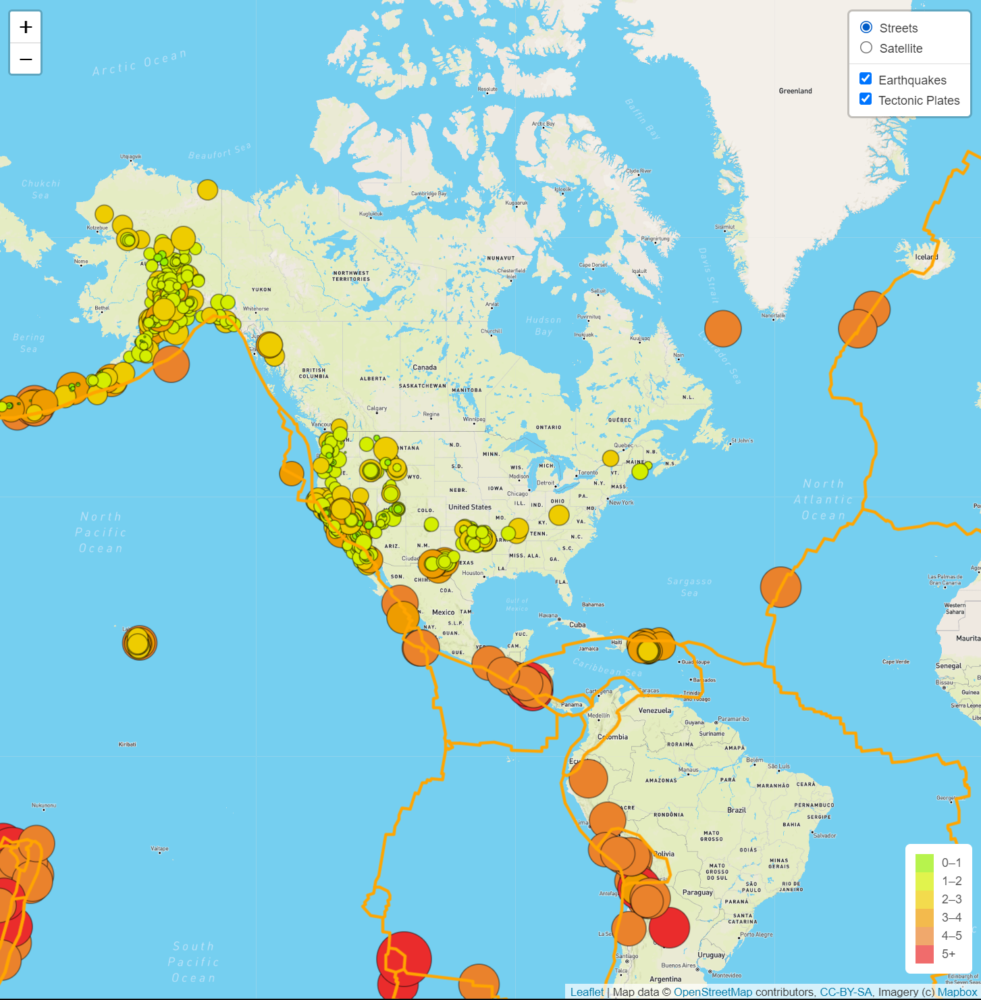
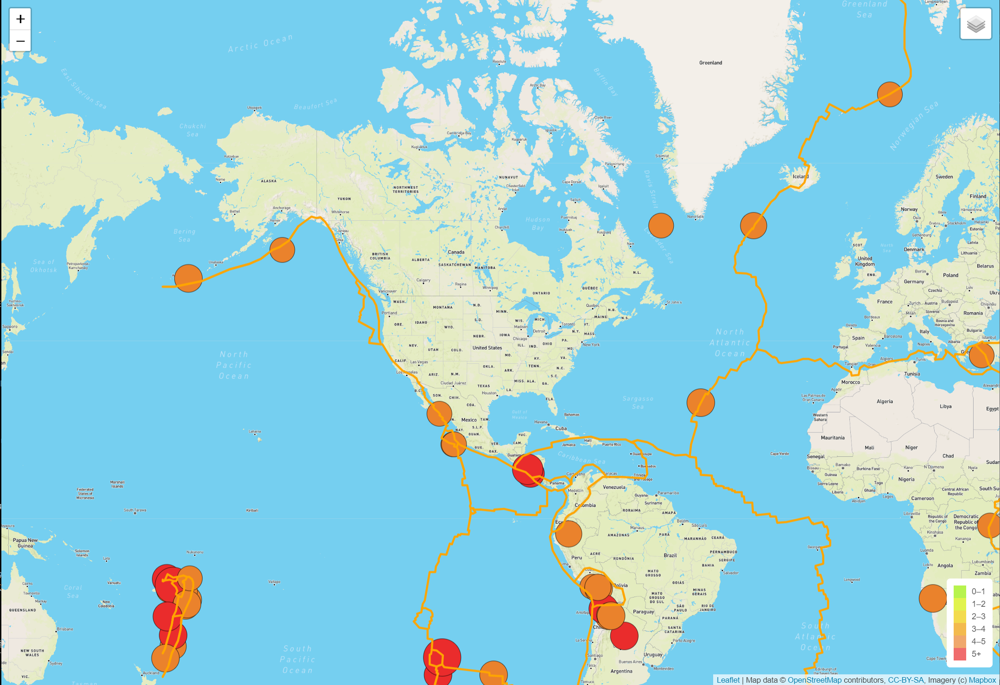
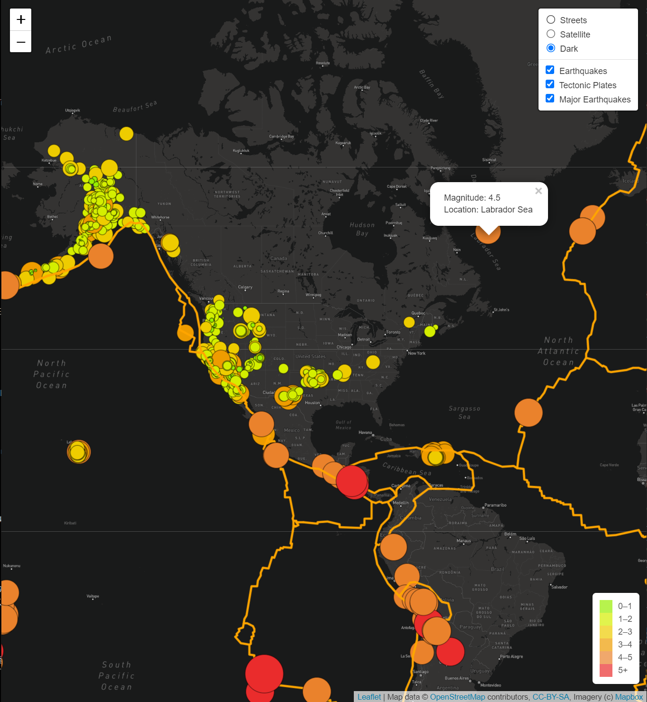

# Mapping_Earthquakes
Visually show the differences between the magnitudes of earthquakes all over the world for the last seven days

## Overview of the Project
In order to visually present the differences between the magnitude of earthquakes in the world, we use the JavaScript and the D3.js library to retrieve the coordinates and magnitudes of the earthquakes from the GeoJSON data. Then, also utilize the Leaflet library to plot the data on a Mapbox map through an API request and create interactivity for the earthquake data.

## Resources
- Data Source: 

  "*USGS Earthquake Hazards Program*" URL:<https://earthquake.usgs.gov/>
  - <https://earthquake.usgs.gov/earthquakes/feed/v1.0/summary/all_week.geojson>
  - <https://earthquake.usgs.gov/earthquakes/feed/v1.0/summary/4.5_week.geojson>
  
  "*GitHub: fraxen/tectonicplates*" URL:<https://github.com/fraxen/tectonicplates>
  - <https://raw.githubusercontent.com/fraxen/tectonicplates/master/GeoJSON/PB2002_boundaries.json>

- API Call: mapbox
- Software: Visual Code Studio, GitBash, anaconda Prompt

## Results
  The eathquakes from the past 7 days are visualized differently in size and color based on their magnitude to easily understand the their differences in a glance. In addition, we added additional features to further analyze about the earthquakes as below three maps:
  
   **Deliverable 1: Add Tectonic Plate Data**
  - The first map have an additional layer displaying the tectonic plates around the world. The tectonic plates are displayed as orange in the map, and we can see that majority of earthquakes are occuring by the tectonic plates. But it is worth noteing that there are several earthquakes occuring a far from tectonic plates.
  
  
   **Deliverable 2: Add Major Earthquake Data**
  - On this map, we added a layer that displays only major earthquakes from the past 7days. This layer filters out any earthquakes below its magnitude 4.5. As a result, we can confirm that almost all major earthquakes occur by tectonic plates while some weaker earthquakes are not as shown in the previous map image. We can see that there is a strong correlation between earthquake's magnitude level with its location from tectonic plates.
  

   **Deliverable 3: Add an Additional Map**
  - Lastly, we added an additional base map layer to change the look of the map in dark background. This base map layer displays each earthquake better by setting the background as dark color.
  

